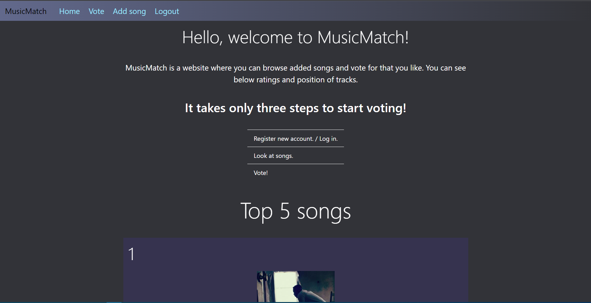
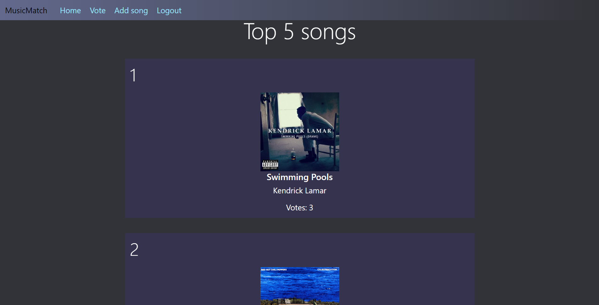
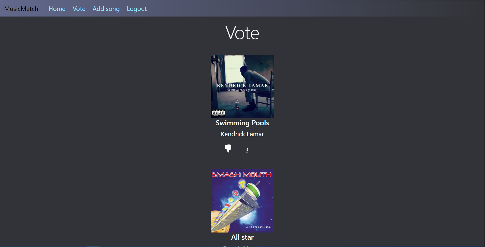

# MusicMatch 🎵

App written in Django where users can vote for their favourite songs.

### About the project 💻

<b>MusicMatch is a website where users can browse songs and vote for what they like. On the Home page there Top 5 songs according to user votes. On the Vote page there are all added songs, where users can vote. Users can also add their suggestions about new songs.<b>

### How to use ⚙️

Only logged users can vote for songs. If you don't have account, create it via register button. Logged users also can add new songs thru form, then administrator publish it on page or before that he can make some changes.

On the home page there is introduction and list of top 5 songs in terms of votes.

On the vote page logged user can vote for song by clicking thumb up icon, if user doesn't like song anymore it is possible to click thumb down icon to unlike the song.

